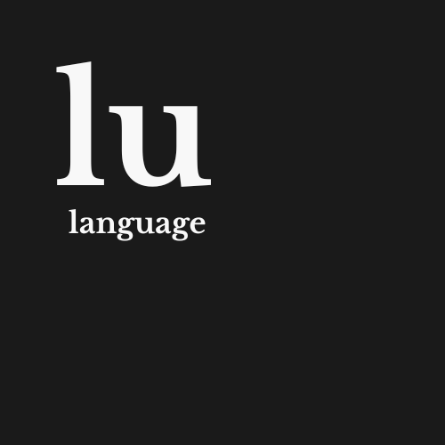
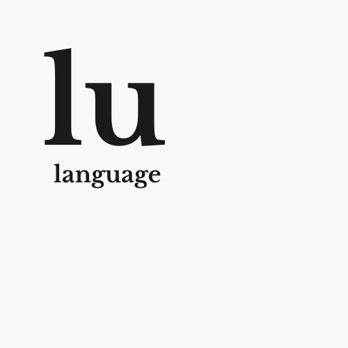

<div style="display: flex; gap: 10px;">
  
  
</div>

# Lu Specification

## About
Lu is a language designed to be used in microcontrollers and stuff like that
where it is more important the control than the security. It looks like C
because I love C but I want to be a bit closer to the device and have some
abstractions.

## disclaimer
As you can see nowadays lu is just a bunch of rules and ideas. I plan to have
a beta version in September 2025.

## Using libc
It can. (todo: specification)

## functions
A function is on the form of `type name ( arg1, arg2, arg3,...) { body }`.
name have to follow `[a-zA-Z_][a-zA-Z_0-9]*` format. The space between name
and parenthesis is not neded. The arguments are in the form `type name [=
default]`. The `...` points is to say that more arguements can be provided. If
a unknown number of arguemts can be provided use arrays or some data structure
that fits better. The function body have its own scope.

```c
none say_hello(str name) {
    printf("Hello, " + name);
}
```

## types

- `byte` -> 1 byte (== raw1)
- `rawN` -> N bytes
- `ptr` -> mem address
- `none` -> as c void
- `word` -> cpu word size variable ( I think its a bad idea because of portability)
- `int` -> signed non decimal num
- `uint` -> unsigned int

- struct -> one or more variables packed
- enum -> enum

- `da` -> dynamic array
- `hm` -> hash map
- `ll` -> double linked list

- `str` -> da of chars

There is no floating point type. Use bigger numbers

```c
byte a = 0b10;
raw1 b = 0xFF;
ptr c = &a; // address of a
int d = -1023;
uint e = 1023;

da<int> f = [a, b, e];
hm<int> g = ["house":1, "me":10];
ll<str> h = ["hello", "world"];

struct i{
    int a = 10; // default value on initialization
    zero byte b; // zero init field by default
    byte c;
}

ptr j = &i;
i.a == j.a;
```

## comments
todo

## Keywords

### export
If a function is declared as export it can be used from other files thatinclude the file in which it is declared. Otherwise it is only visible for thefiles in the same file and its name can be used in other non-global functionfrom other files.

```c
export none foo() {};
```

### zero
Set var-size bytes to zero starting at var-address.
```c
raw a[10];
zero a;
zero raw b[10];
```

### defer
Store the statement in a LIFO queue and execute it while the end of the scope
in which the defer is set is reached.
```c
{ <- start of the scope
    defer print("Hello");
    zero ptr a;
    alloc(a, 10)?;
    defer free(a);
    ...
    <- free(a) is called
    <- print("Hello") is called
} <- end of the scope

```

### self

```c
struct A {
    str name;
    str get_name(self a) = { a.name };
    none set_name(self a, str name) = {self.name = name; };
}
```

if a function inside a struct has a self parameter, outside the declaration
    this argument must not be provided, instead it automatically is set to the
    struct (or to a pinter to the struct).

```c
A a;
a.foo(10) ---> foo(a, 10)
```

### todo, panik, unreachable
Those functions terminate the program execution with a diagnostic of where it
is called and a message from the user.
```c
panik("Some error");
// $ path/file:line: PANIK: Some error
```

## Some strange behaviour
if a {,} pair ends with a statement without ; it returns its value.

## Loop labels
In the case where two o more loops are nested, it would be needed to break
other different than the last loop. It can be solved using loop labels. also
work for continue.

```c
f: for (){
    for(){
        break f;
    }
}
```

## STR
str is a pointer to a str-struct at the offset there data starts. It works as a dynamic array. The data ends with a null
terminated character to be compatible with C. The str struct has some methods related to strings.
```c
struct str_struct {
        uint capacity;
        uint count;
        char data;
    };

type str = str_struct + offset(str_struct.data);
```
